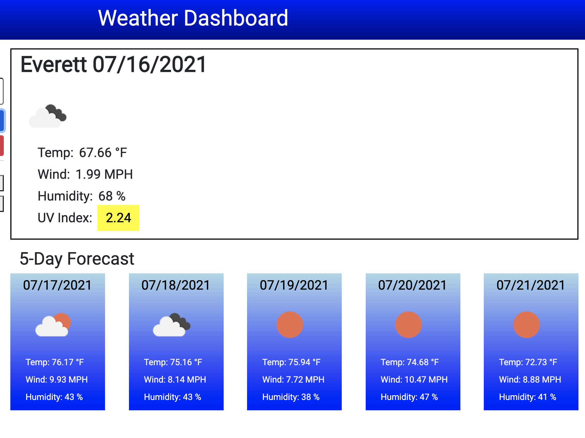

# Weather-Dashboard

The Weather Dashboard was built to allow the user the ability to look up the current weather in their area. When the user inputs the city and clicks the search button; the current forecast (temp, wind, humidity, UV index), and the upcoming 5 day forecast (temp, wind, humidity). The UV Index highlights current sun exposure using colors depending on the severity. The past city entered will have buttons under the Search button in case the user wants to refer back to one of them (it will pull the current weather and 5-Day Forecast).

## Table of Contents

- [About the Project](#about-the-project)
- [Installation](#installation)
- [Usage](#usage)
- [Credit](#credit)
- [License](#license)

## About the Project

- This project was built to allow the user the ability to look up the current weather in their area.
- The motiviation for this project is to use API's to fetch information and utilize past javascript and jquery skills.
- Two API's were needed to access the weather information. One to find the latitude and longitude of the city entered and the second to pull the weather information.
- For every city entered, a button will be created to allow the user the ability to review the current weather forecast at any time.
- The weather icons are provided to give the user a visual view of the weather.
- The UV Index is color coordinated to display the current condition for the user.
  The Scale follows the EPA guidelines: - **Low** (UV Index 0 to 2) - **Green** - _low risk from the sun for the average person._ - **Moderate** (UV Index 3 to 5) - **Yellow** - _moderate risk from unprotected sun exposure._ - **High** (UV Index 6 to 7) - **Orange** - _high risk from unprotected sun exposure, protection needed._ - **Very High** (UV Index 8 to 10) - **Red** - _very high risk from unprotected sun exposure, take extra precaution._ - **Extreme** (UV Index 11 and above) - **Magenta** - _extreme risk from unprotected sun exposure, take all protections because skin can burn in minutes._
- Built with the following technologies:
  - [Bootstrap](https://getbootstrap.com/)
  - [bulma-debug.css](https://gist.github.com/JuanVqz/105c4910ff711659059c99492ecd1a5c) used to debug CSS layout
  - [Google Fonts](https://fonts.google.com/)
  - [jQuery](https://jquery.com/)
  - [Moments.js](https://momentjs.com/)
  - [OpenWeather API](https://openweathermap.org/api)
    - [Current Weather Data](https://openweathermap.org/api) API
    - [One Call API](https://openweathermap.org/api) API
  - HTML, CSS, and Javascript
- Comments have been added to the HTML, CSS and JS files to clarify each step and make future updates easier.

## Installation

- Open [Weather Dashboard](https://twashke.github.io/Weather-Dashboard/)
- Or, open index.html in the internet browser.

## Usage

- Go to [Deployed Github Page](https://twashke.github.io/Weather-Dashboard/)
- Enter in the city and click the Search button (if the input is not a city, it will return an error to try again).
- At the top the current weather will be displayed under the city name and date with the following information:
  - Weather Icon of the current weather.
  - Temperature in Fahrenheit.
  - Wind Speed in miles per hour (MPH).
  - Humidity percentage.
  - UV Index (changes colors depending on EPA guidelines).
- The 5-Day Forecast will be displayed under the date of the next five days with the following information:
  - Weather Icon of the current weather.
  - Temperature in Fahrenheit.
  - Wind Speed in miles per hour (MPH).
  - Humidity percentage.
- Previous cities chosen will be displayed underneath the Search button, if the user presses one of the past entries it will again provide the current weather and 5-Day forecast.
- Use the **Clear History** button to clear out history.

Weather Dashboard Demo \
 \
\
Start Page for Weather Dashboard \
 \
\
Invalid User Input Error \
 \
\
Current and 5-Day Forecast \
 \
\
Weather Dashboard Previous Search Buttons \
 \
\
Clear History Button \

## Credit

- [OpenWeather API](https://openweathermap.org/api)
  - Current Weather Data (for latitude and longitude)
  - One Call API (for current weather and five day forecast)

## License

The MIT License (MIT)

Copyright (c) 2015 Chris Kibble

Permission is hereby granted, free of charge, to any person obtaining a copy of this software and associated documentation files (the "Software"), to deal in the Software without restriction, including without limitation the rights to use, copy, modify, merge, publish, distribute, sublicense, and/or sell copies of the Software, and to permit persons to whom the Software is furnished to do so, subject to the following conditions:

The above copyright notice and this permission notice shall be included in all copies or substantial portions of the Software.

THE SOFTWARE IS PROVIDED "AS IS", WITHOUT WARRANTY OF ANY KIND, EXPRESS OR IMPLIED, INCLUDING BUT NOT LIMITED TO THE WARRANTIES OF MERCHANTABILITY, FITNESS FOR A PARTICULAR PURPOSE AND NONINFRINGEMENT. IN NO EVENT SHALL THE AUTHORS OR COPYRIGHT HOLDERS BE LIABLE FOR ANY CLAIM, DAMAGES OR OTHER LIABILITY, WHETHER IN AN ACTION OF CONTRACT, TORT OR OTHERWISE, ARISING FROM, OUT OF OR IN CONNECTION WITH THE SOFTWARE OR THE USE OR OTHER DEALINGS IN THE SOFTWARE.
